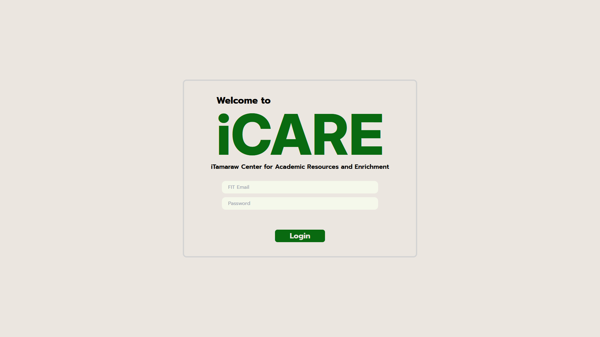
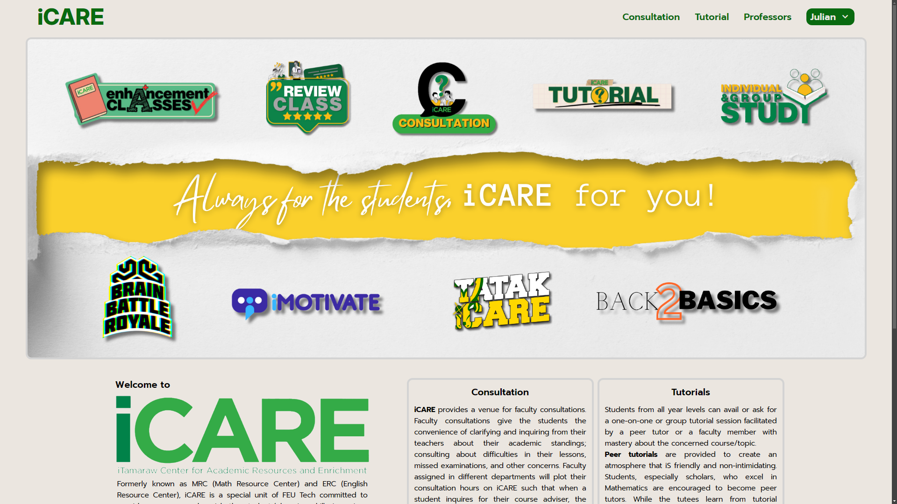
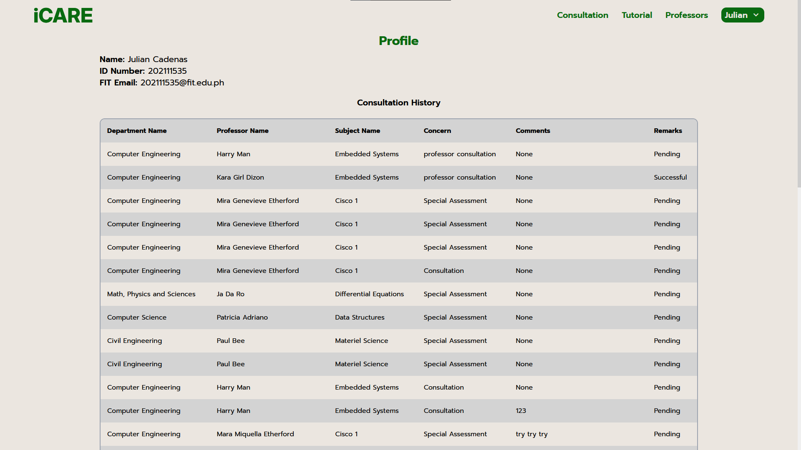
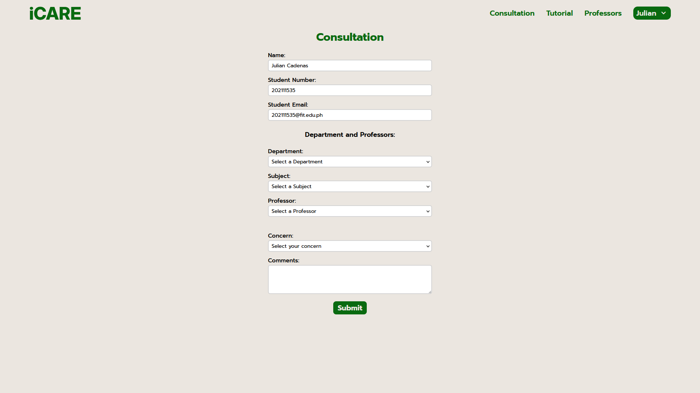
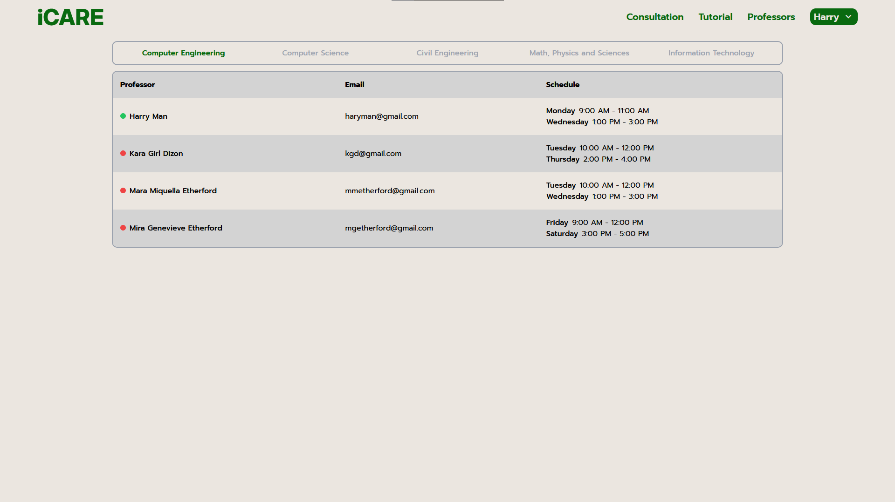
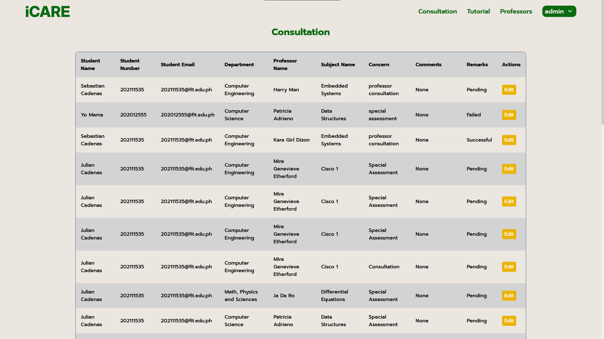

# iCARE WEBSITE 

My first CRUD project was the [iCARE Website](https://github.com/julsCadenas/iCARE-Website), originally written in PHP. I am now rewriting it using the MERN tech stack.
The project emulates the school's system, where if a person is enrolled, they automatically have an account within the web app, which explains the lack of a "sign up" function.

[OPEN HERE](https://icare-unofficial.vercel.app/)

## Tech Stack:
### Backend
- MongoDB using the Mongoose library
- Express JS
- Node JS
- Backend is deployed on [Render](https://render.com/)

### Frontend
- React JS
- Axios
- Tailwind CSS
- Frontend is deployed on [Vercel](https://vercel.com/)

### Accounts for public use

Email: ```johndoe@gmail.edu.com```
 Password: ```password```

### Admin account

Email: ```admin```
 Password: ```admin```

## How to run:
```bash
cd path/to/project
```
### Backend
```bash
cd backend
npm i
npm run dev 
```
### Frontend
```bash
cd frontend
npm i
npm run dev 
```

# Website Screenshots

## Login page


## Dashboard


## User Profile


## Consultation Form


## Prof Table


## Admin Consultation Page

